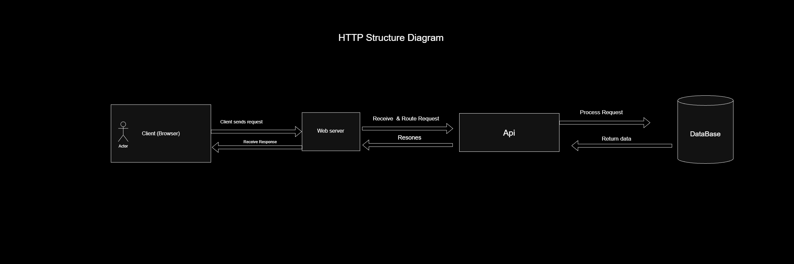
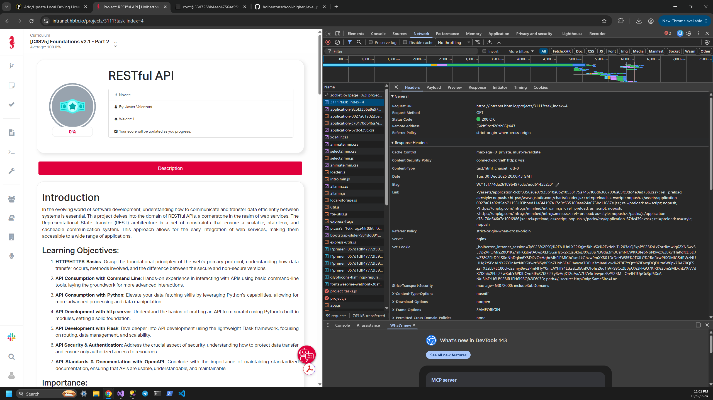

## RESTful API Project

### Introduction
In today’s fast‑growing software landscape, efficient communication and data exchange between systems is essential.  
This project explores RESTful APIs — one of the core technologies behind modern web services. REST (Representational State Transfer) provides a scalable, stateless, and cacheable architecture that enables smooth integration and reliable communication across internet applications.

## HTTP vs HTTPS

**HTTP (Hypertext Transfer Protocol)** is the original protocol used for transferring data over the web.  
However, HTTP does **not encrypt** the data, which makes it vulnerable to interception and unauthorized access.

**HTTPS (Hypertext Transfer Protocol Secure)** is the secure version of HTTP.  
It adds an **encryption layer using SSL/TLS**, ensuring that the data exchanged between the client and the server is encrypted, private, and protected from tampering or eavesdropping.

## 🧭 HTTP Request Flow Diagram

This diagram illustrates the flow of an HTTP request from the client through the server and API, ending at the database and returning the response back to the client.

## 📸 Screenshot: HTTP Request from Browser DevTools

The image below shows an actual HTTP GET request inspected from the browser’s developer tools:

## 📤 Common HTTP Methods

GET     -- Retrieves data from server      -- Fetch user profile  
POST    -- Sends new data to server        -- Submit registration form  
PUT     -- Updates existing data           -- Edit user account info  
DELETE  -- Deletes data from server        -- Remove a comment or post  

## 📤 Common HTTP Status Codes

200     -- OK – Success                    -- Request processed successfully  
201     -- Created                         -- New resource successfully created  
301     -- Moved Permanently               -- Resource permanently moved to a new URL  
404     -- Not Found                       -- Page or resource doesn’t exist  
500     -- Internal Server Error           -- Server crashed or encountered unexpected error  

